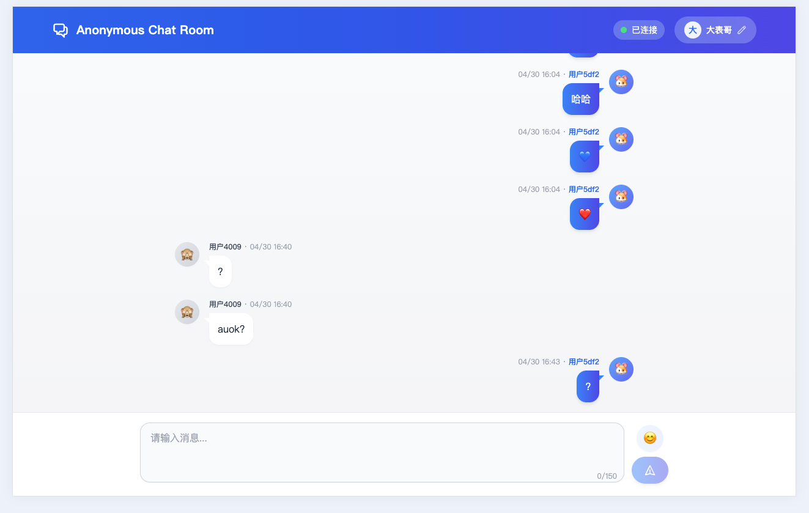

# ESP32 匿名聊天室




## 项目概述

本项目是一个基于ESP32的局域网匿名聊天室系统，包含以下主要功能：

1. RESTful API服务器，提供聊天消息发送和接收功能
2. 系统信息和传感器数据接口
3. 响应式Web前端界面
4. 支持多种部署模式（主机调试、SPI闪存、SD卡）

聊天室具有以下特点：
- 匿名聊天，支持自定义用户名
- 自动生成唯一用户ID
- 消息实时更新
- 表情符号支持
- 响应式设计，适配不同设备

## API接口说明

本项目实现了以下RESTful API接口：

| API                         | 方法   | 请求示例                                            | 描述                            | 页面     |
| --------------------------- | ------ | --------------------------------------------------- | ------------------------------- | -------- |
| `/api/v1/system/info`       | `GET`  | -                                                   | 获取系统信息（版本、核心数等） | 首页     |
| `/api/v1/temp/raw`          | `GET`  | -                                                   | 获取温度传感器原始数据          | 图表页面 |
| `/api/v1/chat/uuid`         | `GET`  | -                                                   | 生成新的用户UUID                | 聊天室   |
| `/api/v1/chat/messages`     | `GET`  | `?since=1621234567`                                 | 获取指定时间戳后的消息          | 聊天室   |
| `/api/v1/chat/message`      | `POST` | `{"uuid":"...", "username":"...", "message":"..."}` | 发送新聊天消息                  | 聊天室   |

## 网络发现

**mDNS服务** - 可通过 `http://chat.local` 访问（默认域名可在菜单中配置）

## 部署模式

项目支持三种Web前端部署模式：

1. **主机调试模式 (Semihost)** - 通过JTAG连接从主机读取网页文件，便于开发调试
2. **SPI闪存模式** - 将网页文件存储在ESP32的SPI闪存中，适合中小型网站（<2MB）
3. **SD卡模式** - 将网页文件存储在SD卡中，适合较大型网站（>2MB）

## 硬件要求

- ESP32开发板或核心板（如ESP32-DevKitC）
- 可选：JTAG适配器（Semihost模式下需要）
- 可选：SD卡及读卡模块（SD卡存储模式下需要）

### SD卡模式引脚连接

| ESP32  | SD卡   |
| ------ | ------ |
| GPIO2  | D0     |
| GPIO4  | D1     |
| GPIO12 | D2     |
| GPIO13 | D3     |
| GPIO14 | CLK    |
| GPIO15 | CMD    |

## 配置与编译

### 项目配置

使用 `idf.py menuconfig` 打开配置菜单：

1. **网络连接配置** (Example Connection Configuration)
   - 选择网络接口（Wi-Fi/以太网）
   - 配置Wi-Fi凭据或以太网参数

2. **项目配置** (Example Configuration)
   - 设置mDNS主机名
   - 选择网站部署模式
   - 配置挂载点路径

### 前端构建

完成Web前端开发后，构建生成静态文件：

```bash
cd front
npm install
npm run build
```

构建完成后将在 `front/dist` 目录生成所有静态资源文件。

### 编译与烧录

```bash
idf.py -p PORT flash monitor
```

## 前端技术栈

- Vue.js - 渐进式JavaScript框架
- Tailwind CSS - 实用优先的CSS框架
- TypeScript - 类型安全的JavaScript超集

## 调试与排错

1. **JTAG调试** - 使用Semihost模式时，需运行支持semihost的OpenOCD：
   ```bash
   openocd-esp32/bin/openocd -s openocd-esp32/share/openocd/scripts -f board/esp32-wrover-kit-3.3v.cfg
   ```

2. **常见问题**：
   - 构建错误 `...front/web-demo/dist doesn't exit` - 需要先执行 `npm run build` 生成前端文件
   - Wi-Fi连接问题 - 检查SSID和密码配置是否正确
   - mDNS解析失败 - 确认客户端设备支持mDNS服务
